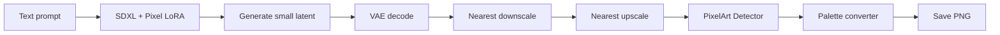

# ComfyUI Pixel Art Starter Pack

Everything you need to build a **local pixel art workflow** in ComfyUI: install scripts, ready-made workflow JSONs, retro palettes, and model download links.

## Quick start (your PC)

### Option A — clone just this folder

If you only want the starter pack (you already have ComfyUI):

```bash
git clone https://github.com/SamMurphyUK/strategy-demo.git
cd strategy-demo/comfyui-pixel-art
```

On Windows, open PowerShell in that folder and run `.\setup.ps1`.  
On Linux/macOS: `chmod +x setup.sh && ./setup.sh`

### Option B — copy workflows manually

Copy `workflows/` into your ComfyUI install:

```
ComfyUI/user/default/workflows/pixel-art/
```

Then drag any `.json` file into the ComfyUI browser.

---

## What's included

### Workflows (`workflows/`)

| File | What it does | Custom nodes needed |
|------|----------------|---------------------|
| `sdxl-pixel-art-txt2img.json` | Generate pixel art from a text prompt (SDXL + LoRA, nearest upscale) | Built-in only |
| `img2pixel-nearest-only.json` | Quick downscale/upscale pixelate on any image | Built-in only |
| `workflow.json` | Full PixelArt Detector pipeline (quantize, palette, save) | PixelArt-Detector |
| `palette_generator.json` | Extract a palette from a reference image | PixelArt-Detector |
| `grid.json` | Preview all loaded palettes in a grid | PixelArt-Detector |
| `img2img_webp.json` | Img2img + pixel post-process | PixelArt-Detector |
| `palette-art/*.json` | Palette build/mix/sort pipelines | pixel_palette_art |

### Palettes (`palettes/`)

8 classic 1-pixel-wide palette strips (DawnBringer 32, PICO-8, Sweetie 16, Endesga 32, Game Boy variants). Copy into:

```
ComfyUI/custom_nodes/ComfyUI-PixelArt-Detector/palettes/1x/
```

The setup script does this automatically.

### Custom nodes (installed by `setup.sh`)

| Node pack | Purpose |
|-----------|---------|
| [ComfyUI-Manager](https://github.com/ltdrdata/ComfyUI-Manager) | Install/update nodes from the UI |
| [ComfyUI-PixelArt-Detector](https://github.com/dimtoneff/ComfyUI-PixelArt-Detector) | Palette swap, downscale, dither, pixel-perfect output |
| [pixel_palette_art](https://github.com/ranska/pixel_palette_art) | Build and export palettes |
| [GlitchNodes](https://github.com/pxl-pshr/GlitchNodes) | Pixel8Bit + retro dithering |
| [ComfyUI-AI-Pixel-Art-Enhancer](https://github.com/HSDHCdev/ComfyUI-AI-Pixel-Art-Enhancer) | AI → pixel art conversion |
| [comfyui-vslinx-nodes](https://github.com/vslinx/ComfyUI-vslinx-nodes) | Image to Pixel Art with historical palettes |

See `manifest.json` for the full machine-readable list.

---

## Models you still need to download

Models are too large to bundle. See **[models.md](models.md)** for direct links.

Minimum for text-to-image:

1. **SDXL 1.0 base checkpoint** → `ComfyUI/models/checkpoints/`
2. **pixel-art-xl LoRA** → `ComfyUI/models/loras/`

---

## Recommended workflow order

```
1. setup.sh          → install ComfyUI + nodes
2. Download models   → see models.md
3. python main.py    → start server
4. Load sdxl-pixel-art-txt2img.json
5. Tweak prompt, run
6. Chain into workflow.json for palette lock + dither
```

### Typical pixel art pipeline



For **img2img** or **photo → pixel art**, start with `img2pixel-nearest-only.json` or the AI Pixel Art Enhancer node.

---

## Troubleshooting

| Problem | Fix |
|---------|-----|
| Red/missing nodes after load | Run `setup.sh` again; install missing node via ComfyUI Manager |
| Out of VRAM | `python main.py --lowvram` or use smaller resolution (512×512) |
| Blurry output | Ensure all scale nodes use `nearest-exact`, not bilinear |
| LoRA not found | Download `pixel-art-xl.safetensors` to `models/loras/` |
| Checkpoint not found | Pick your SDXL file in the CheckpointLoader node |

---

## File origins

Workflow JSONs are sourced from:

- [dimtoneff/ComfyUI-PixelArt-Detector](https://github.com/dimtoneff/ComfyUI-PixelArt-Detector) (MIT)
- [ranska/pixel_palette_art](https://github.com/ranska/pixel_palette_art)
- [appliedintelligencelab SDXL pixel art gist](https://gist.github.com/appliedintelligencelab/ca9a4e18dde220d394f10b3f22e9c2ba)

Palettes from ComfyUI-PixelArt-Detector's bundled set.

---

## Requirements

- Python 3.10+
- Git
- NVIDIA GPU with 8+ GB VRAM recommended (CPU works for post-process only)
- ~15 GB disk for ComfyUI + one SDXL checkpoint
